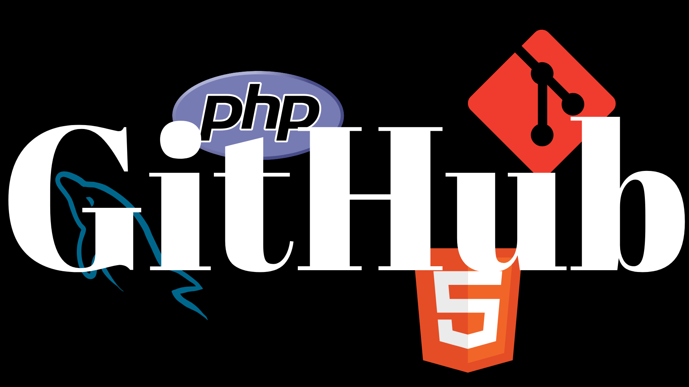

<h2 align="center"> Merhaba 👋! Ben Abdullatif ÇAKMAK </h2>

🎓 Yazılım Mühendisliği öğrencisiyim  
🛠️ Laravel, React Native, Firebase, MySQL, HTML CSS, JavaScript, Python  
📈 Projelerimde gerçek dünya ihtiyaçlarına çözüm üretmeyi seviyorum  
🌱 Şu anda `stok ve cari hesap takip sistemi` geliştiriyorum  
📬 Bana ulaş: alatifcakmak@gmail.com

  
  
  

<h3 align="left">  Skills</h3>

<table> <tr> <td align="center" width="100">   <b>Laravel</b> </td> <td align="center" width="100">   <b>PHP</b> </td> <td align="center" width="100">   <b>JavaScript</b> </td> <td align="center" width="100">   <b>MySQL</b> </td> </tr> <tr> <td align="center" width="100">   <b>Git</b> </td> <td align="center" width="100">   <b>HTML5</b> </td> <td align="center" width="100">   <b>CSS3</b> </td> <td align="center" width="100">   <b>GitHub</b> </td> </tr> </table>

<h3 align="left">  Github Statistics</h3>

  
  &nbsp;&nbsp;
  

  

<!--
**abdullatifcakmak/abdullatifcakmak** is a ✨ _special_ ✨ repository because its `README.md` (this file) appears on your GitHub profile.

Here are some ideas to get you started:

- 🔭 I’m currently working on ...
- 🌱 I’m currently learning ...
- 👯 I’m looking to collaborate on ...
- 🤔 I’m looking for help with ...
- 💬 Ask me about ...
- 📫 How to reach me: ...
- 😄 Pronouns: ...
- ⚡ Fun fact: ...
-->
